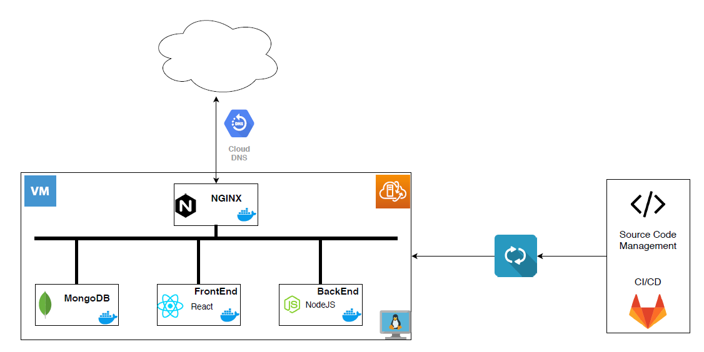

# CPSC2650 - Project

Schedule for Langara Classes

## Project Design



## Install

### 0. Prerequisites

- Docker
- Git

This project uses `Docker` to run each part of the application.
To install `Docker` follow the instructions in the
[Docker website](https://www.docker.com/get-started).

Git is a version control system (VCS). To install `git` follow
the instructions in the [Git website](https://git-scm.com/downloads)

### 1. Clone

The first step is to clone the project:

```
git clone https://gitlab.com/gusbru/cpsc2650-project.git
```

Enter the project directory:

```
cd cpsc2650-project
```

### 2. Configuration Files

Both `backend` and `frontend` uses a `.env` configuration
file to manage

#### Frontend

Enter the frontend directory:

```
cd frontend
```

Inside the folder `frontend` create a new file `.env`.

```
touch .env
```

Add the following lines inside the file.

```
REACT_APP_MODE="dev"
REACT_APP_BACKEND_DEV_URL=http://<dev-location>:3030
REACT_APP_BACKEND_PROD_URL=<prod-url>
```

Fill up the `<dev-location>` field with the address of your machine.
For example, in the case of using AWS, go to Services &rarr; EC2 &rarr; Instances
and select the running instance. On the bottom panel find the field where
the Public DNS (IPv4) is located and copy its value.

In the case of production, change the first line to `"prod"` and fill up the last line
`<prod-url>` with the address of your backend. In that case, probably it is necessary
to register the address on to a DNS server.

If only the development server is going to be set up, the last line can remain unchanged.

Come back to the root directory of the project.

```
cd ..
```

#### Backend

Inside the `backend` folder create a new file `.env`.

```
cd backend
touch .env
```

Add the following lines inside the file:

```
SECRET=<some string>
MONGO_URL=mongodb://some-mongo:27017/project
```

Replace `<some string>` with some random characters. The string is used to create the token (JWT).

Regarding the `MONGO_URL`, no changes are needed. Only update it if the name of the container
(`some-mongo`) running MongoDB changed or if the database name change (in that case `project`).

Go back to the root directory of the project

```
cd ..
```

#### Firewall

At this point, it is a good idea to open the port that will be used by the backend server. The server
will listen on port `3030` and the frontend on port `80`. It is necessary to allow incoming connections through that port. If a cloud-based service is been used (AWS, GCLOUD) it is necessary to add that port to the firewall rules.

For AWS, go to Services &rarr; EC2 &rarr; Instances and select the running instance. On the bottom panel find `Security Groups` and click on the link. Inside the `Security Groups` look for the `Inbound rules` tab and
click on it. Select `Edit inbound rules` and add a new rule. Fill up the port range with `3030` and select
`anywhere` for the source. Save the added rule. Add another port `80` allowing incoming connection from
`anywhere`.

In the end, the ports `80` and `3030` were added to the firewall list and incoming connections are allowed
on those two ports.

#### NGINX

### 3. Start the Docker Containers

To execute the project locally, it is necessary to load 4 containers:

  1. mongodb
  2. backend
  3. frontend
  4. nginx

There are two ways to start containers:
i) start all at once using `docker-compose`
ii) start one by one

#### 3.1 Start all dockers at once

Before start, all dockers, install `docker-compose`, if not installed yet. 
More details on how to install `docker-compose` can be found at [docker web site](https://docs.docker.com/compose/install/)

After installing `docker-compose`, go to the project root directory and run:

```
docker-compose up
```

To stop, hit `ctrl-c` and clean-up the environment through:

```
docker-compose down
```

#### 3.2 Start each docker individualy

Before the start of all the containers, it is necessary to create a docker network.

```
docker network create -d bridge my-net
```

All the following commands are executed within the project root folder.

##### 3.2.1 mongodb

The container MongoDB can run in the background, but the other three are going to run
on the iterative mode (when running on dev mode), and each one in a separate terminal.

Start the MongoDB container

```
./adminScripts/start-mongo-container.sh
```

Check that the container is running

```
docker ps
```

##### 3.2.2 backend

Start the backend server:

```
./adminScripts/start-backend-dev-container.sh -it
```

Install the dependencies and start the server

```
npm install
npm run dev
```

If everything was right, the following message should appear

```
DB connected!
Server ready on 3030
```

##### 3.2.3 frontend

On another terminal start the `frontend` container:
(be sure to enter into the project root folder after start a new terminal)

```
./adminScripts/start-frontend-dev-container.sh -it
```

Inside the container install the dependencies and start the frontend server

```
npm install
npm start
```

##### 3.2.4 nginx

The last step is to start the `nginx` server.
On another terminal start the `nginx` container:
(be sure to enter into the project root folder after start a new terminal)

```
./adminScripts/start-nginx-dev-container.sh -it
```

### 4. Upload Schedule

On the application first start, no time tables are available.
Currently, it is not possible to add subjects individually.
Instead, the schedule is loaded by parsing the HTML file obtained from
[Langara Registration Search](https://langara.ca/reg-guide/index.html).
Also, there are two examples files inside the [`html-example`](https://gitlab.com/gusbru/cpsc2650-project/-/tree/master/html-example) directory that can
be downloaded and used on the steps below.

To upload a new time table, go to the `/admin` location. Go to the tab where the application
is running and add `/admin` at the end of the address.

You can check the currently available time tables by checking `Current Calendars` and add a new one
inside `Add new Schedule`.

To upload a new calendar, click on `Add new Schedule` and `Upload a New Schedule`. Select the
HTML file containing the times getting from Langara register website. Give a name to the file
by filling up the `Term name` field and click on `Submit`. After finished upload the calendar, the
calendar name will appear under `Current Calendars`.

### 5. Making a Schedule

Go back to the `Scheduler` (just remove `/admin` from the address bar) and make a schedule.

1. Select a term
2. Choose one subject
3. Select the desired courses
4. Repeat steps 2 and 3 until select all the desired courses
5. Generate the Schedules
